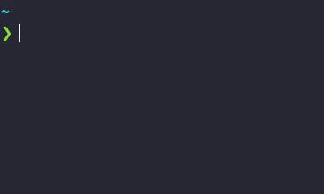

<h1 align="center">
  
</h1>

<h2 align="center">Semana OmniStack 11.0 🚀</h2>

<p align="center">
  
  
  <a
    href="https://github.com/nicolas-justin/be-the-hero/commits/master">
    
  </a>
  <a
    href="https://github.com/nicolas-justin/be-the-hero/issues">
    
  </a>
  <a
    href="LICENSE.md">
    
  </a>
</p>

<p align="center">
  <a href="#-projeto">Projeto</a>
  &nbsp;&nbsp;&nbsp;|&nbsp;&nbsp;&nbsp;
  <a href="#-requisitos">Requisitos</a>
  &nbsp;&nbsp;&nbsp;|&nbsp;&nbsp;&nbsp;
  <a href="#-tecnologias">Tecnologias</a>
  &nbsp;&nbsp;&nbsp;|&nbsp;&nbsp;&nbsp;
  <a href="#-clonando">Clonando</a>
  &nbsp;&nbsp;&nbsp;|&nbsp;&nbsp;&nbsp;
  <a href="#-contribuindo">Contribuindo</a>
  &nbsp;&nbsp;&nbsp;|&nbsp;&nbsp;&nbsp;
  <a href="#-licença">Licença</a>
</p>

<br>

<p align="center">
  
</p>

<br>

## 📦 Projeto

O Be The Hero é um projeto que visa auxiliar ONGs a encontrar financiadores para ajudar em problemas específicos.

<br>

## 📝 Requisitos

Para executar esse projeto é necessário ter o **Node.js** e **NPM** instalados em seu computador:

- [Node.js](https://nodejs.org/en/)
- [NPM](https://www.npmjs.com/get-npm)

Após a instalação, verifique se ambos foram instalados corretamente, executando os comandos:



> 📌 **Nota:**
>
> - Se os comandos não forem encontrados, reinicie o terminal.
>
> - Se ainda não funcionar, verifique se o caminho onde o _Node.js_ foi instalado, encontra-se nas variáveis de ambiente, se não estiver, insira-o e reinicie o terminal novamente.
>
> - Em último caso, reinstale o _Node.js_.

<br>

## ⚡️ Tecnologias

Esse projeto foi desenvolvido com as seguintes tecnologias:

### ⚙️ Back-end

- [Node.js](https://nodejs.org/en/)
- [Express](http://expressjs.com/)
- [Knex](http://knexjs.org/)
- [SQLite3](https://github.com/mapbox/node-sqlite3)

### 💻 Front-end

- [ReactJS](https://reactjs.org/docs/getting-started/)
- [React Router Dom](https://reacttraining.com/react-router/web/guides/quick-start)
- [Axios](https://github.com/axios/axios)
- [React Icons](https://react-icons.netlify.com/)

### 📱 Mobile

- [React Native](https://reactnative.dev/)
- [Expo CLI](https://docs.expo.io/versions/latest/)
- [React Navigation](https://reactnavigation.org/docs/getting-started)
- [Intl](https://github.com/andyearnshaw/Intl.js)
- [Axios](https://github.com/axios/axios)
- [Expo Mail Composer](https://docs.expo.io/versions/latest/sdk/mail-composer/)

<br>

## 📥 Clonando

Para iniciar o projeto em seu computador, primeiramente é necessário `clonar` esse repositório.  
Para isso, abra o seu terminal, navegue até a pasta onde deseja manter o projeto baixado.  
Após, digite o seguinte comando:

```bash
git clone https://github.com/nicolas-justin/be-the-hero.git
```

<br>

### ⚙ Iniciando o back-end

Feito o download, iniciaremos o _back-end_.  
Navegue até a pasta `be-the-hero/backend`:

```bash
cd be-the-hero/backend
```

Agora iremos instalar as dependências do _back-end_, com o seguinte comando:

```bash
npm install
```

Após baixado as dependências, iremos iniciar o servidor, executando:

```bash
npm start
```

<br>

### 💻 Iniciando o front-end

Agora iremos abrir um novo terminal para o _front-end_.  
Navegue até a pasta `be-the-hero/frontend`:

```bash
cd be-the-hero/frontend
```

Agora iremos instalar as dependências do _front-end_, com o seguinte comando:

```bash
npm install
```

Após baixado as dependências, iremos iniciar o servidor, executando:

```bash
npm start
```

<br>

### 📱 Iniciando o mobile

Por último, abriremos mais um terminal para iniciar o _mobile_.
Navegue até a pasta `be-the-hero/mobile`:

```bash
cd be-the-hero/mobile
```

Agora iremos instalar as dependências do _mobile_, com o seguinte comando:

```bash
npm install
```

Após baixado as dependências, iremos iniciar o servidor, executando:

```bash
npm start
```

Irá gerar uma `URL` e um `QR Code` para conexão.

> 📌 **Nota:**
>
> - Para executar a aplicação em seu celular, baixe o aplicativo chamado [Expo](https://play.google.com/store/apps/details?id=host.exp.exponent) (Android) ou [Expo Client](https://apps.apple.com/app/apple-store/id982107779) (iOS).
>
> - Feito o download, abra o aplicativo, na aba `Tools` escolha a opção `Scan QR Code`.  
>   Agora é só apontar para o `QR Code` gerado anteriormente e seu aplicativo irá abrir.

<br>

## 💡 Contribuindo

Siga os passos abaixo para contribuir com a melhoria do projeto:

- Faça um _fork_ desse repositório;
- Crie uma _branch_ com a sua _feature_: `git checkout -b sua-feature`;
- Faça _commit_ das suas alterações: `git commit -m "Feature: Descrição da sua feature."`;
- Faça _push_ para a sua _branch_: `git push origin sua-feature`;

> 📌 **Nota:**
>
> - Após o _merge_ da sua _pull request_, não esqueça de **deletar** a sua _branch_.

<br>

## 📄 Licença

Esse projeto encontra-se sob a licença MIT.  
Para mais detalhes, consulte o arquivo [LICENSE](LICENSE.md).

<br>

<p align="right">
  <a href="#" title="Topo">⬆ Voltar ao topo</a>
</p>

---

<br>

<p align="center">
  <a
    href="https://linkedin.com/in/nicolas-justin">
    
  </a>
  &nbsp;&nbsp;&nbsp;&nbsp;&nbsp;&nbsp;
  <a
    href="https://twitter.com/onicolasjustin">
    
  </a>
  &nbsp;&nbsp;&nbsp;&nbsp;&nbsp;&nbsp;
  <a
    href="https://t.me/nicolasjustin">
    
  </a>
</p>

<p align="center">
  Construído com ❤️ por Nícolas Justin
</p>
